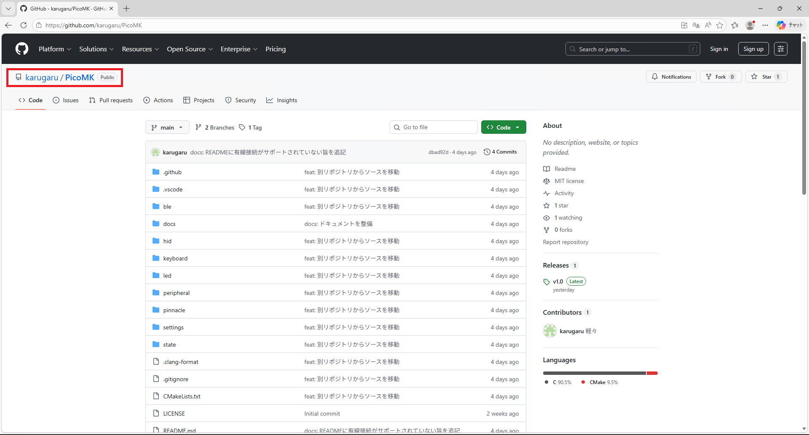
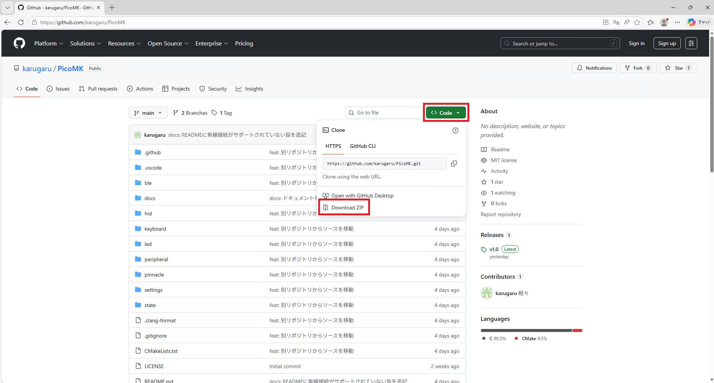
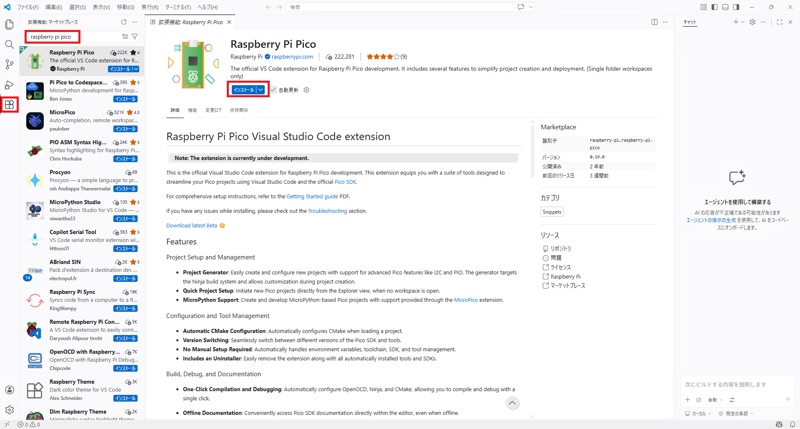
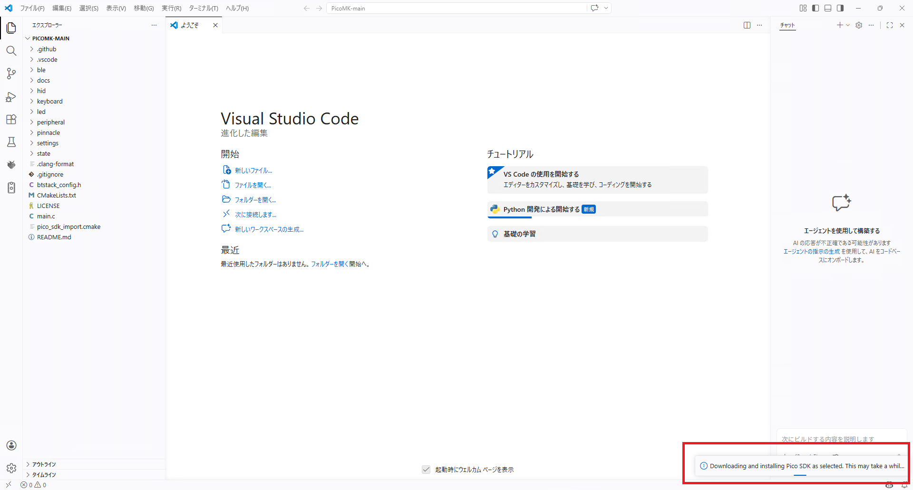
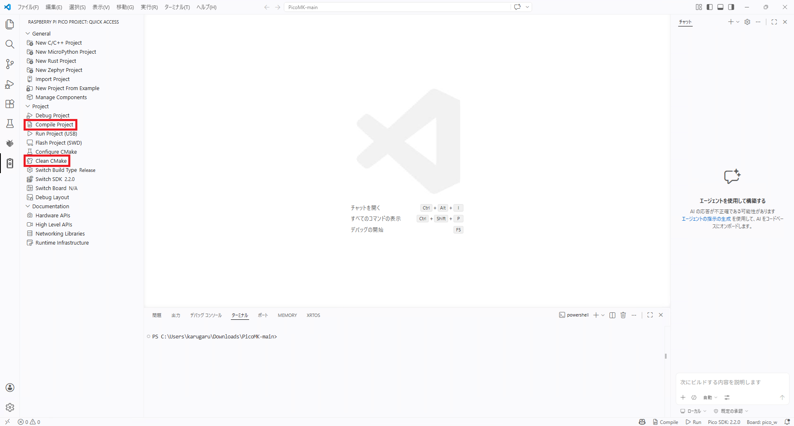
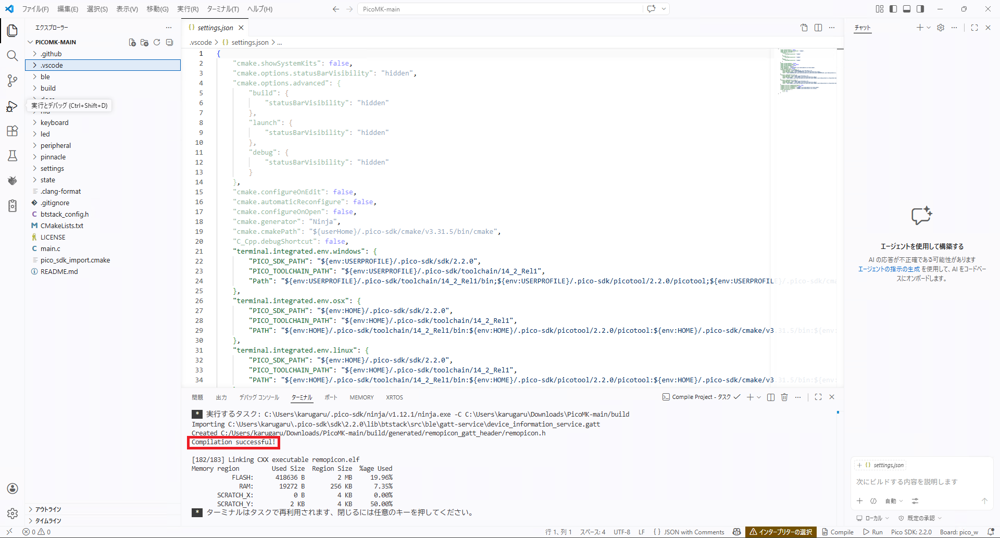
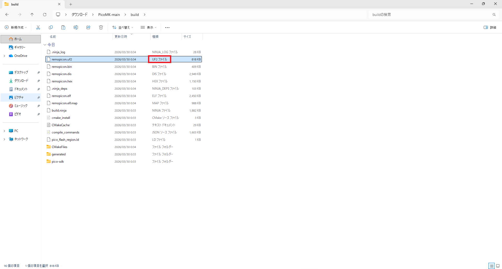

# ビルド手順

## 1. リポジトリのクローン

[PicoMK](https://github.com/karugaru/PicoMK)にアクセスし、リポジトリをクローンします。

最も簡単な方法は、GitHubのウェブサイトで「Code」ボタンをクリックし、「Download ZIP」を選択してダウンロードすることです。

## 2. ビルド環境のセットアップ

Visual Studio Codeをインストールし、必要な拡張機能を追加します。

拡張機能マーケットプレイスで、「Raspberry Pi Pico」と検索し、拡張機能をインストールします。
インストールして、クローンしたディレクトリをVisual Studio Codeで開くと自動でビルド環境がセットアップされます。

## 3. ビルドの実行

ビルド環境がセットアップされたら、Visual Studio CodeのRaspberry Pi Pico Project機能で、「Clean CMake」を実行します。
「Clean CMake」が成功したら、「Compile Project」を実行します。

ビルドが成功すると、下部のターミナルに「Compilation successful」と表示されます。

## 4. ファームウェアの書き込み

Raspberry Pi PicoをBOOTボタンを押しながらUSBで接続し、ブートローダーモードで接続します。

## 4.1. ツールで書き込み

ブートローダーモードで接続した状態で、Visual Studio CodeのRaspberry Pi Pico Project機能で、「Run Project (USB)」を実行します。
実行すると、ビルドしたファームウェアがPicoに書き込まれます。

## 4.2. 手動で書き込み

ビルドしたファームウェアは、クローンしたディレクトリの「build」フォルダ内にあります。
拡張子が「.uf2」のファイルをPicoのドライブにドラッグアンドドロップして書き込みます。

